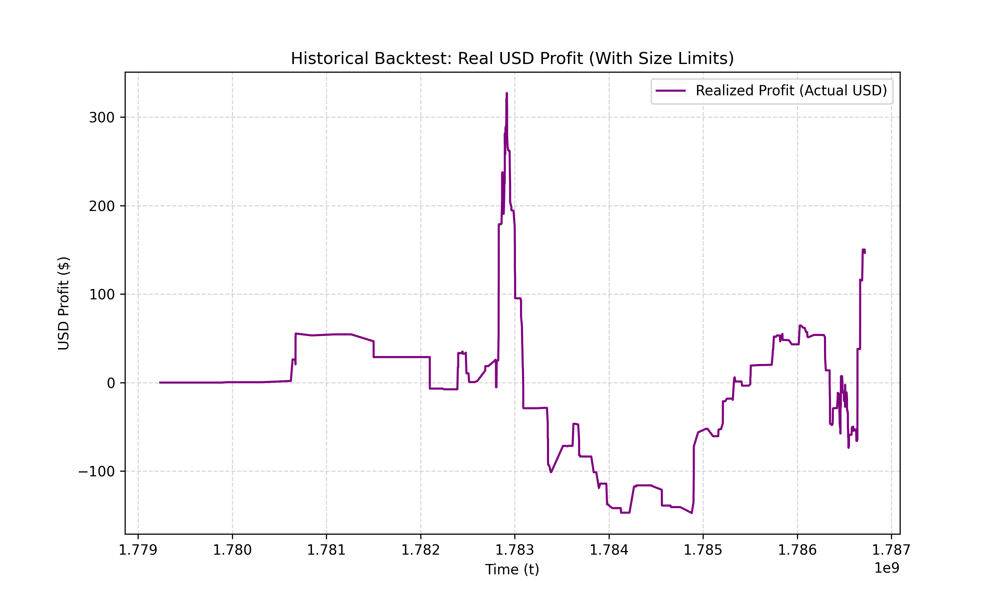
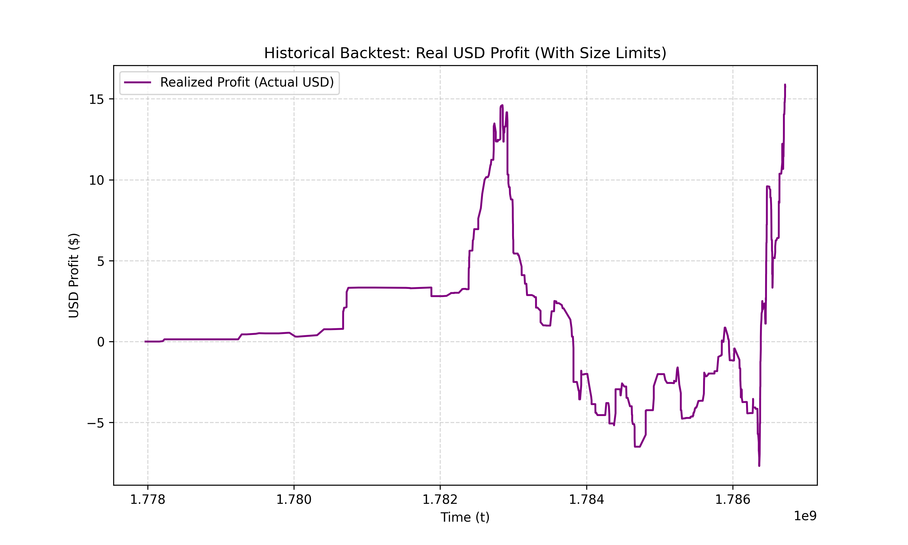

# Options Market Making

A C++17 implementation of the paper **"Algorithmic market making for options"** by Bastien Baldacci, Philippe Bergault, and Olivier Guéant (2020).

## Overview

This project tackles the problem of a market maker in charge of a book of options on a single liquid underlying asset. By using a constant-vega approximation, the paper shows that the seemingly high-dimensional stochastic optimal control problem of an option market maker (with $N$ options + spot + variance state variables) can be reduced to just two state variables:
1. Instantaneous variance ($\nu$)
2. Portfolio vega ($V^\pi$)

This dimensionality reduction allows the problem to be solved via a low-dimensional Hamilton-Jacobi-Bellman (HJB) functional equation.

## Modules & Status

The implementation is broken down into 7 distinct modules:

- [x] **Module 1: Heston Model**
  - Defines the physical and risk-neutral dynamics for the spot and variance.
- [x] **Module 2: Option Pricer**
  - Prices European calls under Heston using the Gil-Pelaez characteristic function inversion.
  - Computes exact Vegas via finite difference.
  - Computes Black-Scholes implied volatilities via Newton-Raphson.
  - *Status: Complete. Values precisely match the paper's exact numerical examples.*
- [x] **Module 3: Market Microstructure (Intensity Functions)**
  - Implements logistic fill probabilities and pre-computes the Hamiltonian $H(p)$.
  - *Status: Complete. Confirmed convexity and $H(0) > 0$ requirement.*
- [x] **Module 4: HJB Solver**
  - The core PDE solver using a monotone explicit Euler scheme on a 3D grid $(t, \nu, V^\pi)$.
  - *Status: Complete. Solved a 216,000 point 3D grid in 0.105 seconds. Peak value matches the paper.*
- [x] **Module 5: Optimal Quotes**
  - Extracts the optimal mid-to-bid and ask-to-mid spreads by inverting the intensity function on the solved value function.
  - *Status: Complete. Successfully extracted and exported to CSV.*
- [x] **Module 6: Simulation Engine**
  - Evaluates the strategy's PnL via Monte-Carlo simulation using Euler-Maruyama discretization.
  - *Status: Complete. 1,000 simulations completed in ~0.4 seconds.*
- [x] **Module 7: Visualization**
  - Python scripts to reproduce all 13 figures from the paper using CSV outputs, plus simulation distributions.
  - *Status: Complete. Generated replication charts using Matplotlib organized into clean subdirectories.*
- [x] **Module 8: Historical Backtesting & Live Data**
  - Offline tick-by-tick backtesting engine tracking normalized mathematical PnL and actual USD realized profit.
  - Automated integration with Binance Options API to ingest live market flow and normalize strikes/prices down to the mathematical Heston grid scale.
  - *Status: Complete. Executed successfully against real BTCUSDT option flow.*

## Mathematical Formulations

### Module 1: Heston Model
The underlying asset $S_t$ and its instantaneous variance $\nu_t$ follow these dynamics under the risk-neutral measure $\mathbb{Q}$ (assuming interest rate $r=0$):

$$ dS_t = \sqrt{\nu_t} S_t dW^S_t $$

$$ d\nu_t = \kappa^\mathbb{Q}(\theta^\mathbb{Q} - \nu_t)dt + \xi \sqrt{\nu_t} dW^\nu_t $$

where the two Wiener processes are correlated: $dW^S_t dW^\nu_t = \rho dt$.

### Module 2: Option Pricer
The price of a European call option is computed using the **Gil-Pelaez Inversion Theorem**:

$$ C = S_0 P_1 - K P_2 $$

The in-the-money probabilities $P_j$ are computed by integrating the complex characteristic function $\phi(u)$:

$$ P_j = \frac{1}{2} + \frac{1}{\pi} \int_0^\infty \text{Re} \left[ \frac{e^{-i u \ln(K)} \phi_j(u)}{i u} \right] du $$

where $\phi_2(u) = \phi(u)$ and $\phi_1(u) = \frac{\phi(u - i)}{S_0}$. 

The option's Vega is calculated with respect to standard deviation, using central finite differences on variance:

$$ \mathcal{V} = \frac{\partial C}{\partial \sqrt{\nu}} = 2\sqrt{\nu} \frac{\partial C}{\partial \nu} $$

### Module 3: Market Microstructure (Intensity Functions)
The market maker's limit orders are executed according to a logistic intensity function depending on the quoted spread $\delta$:

$$ \Lambda(\delta) = \frac{\lambda}{1 + \exp\left(\alpha + \frac{\beta}{\mathcal{V}} \delta\right)} $$

To solve the stochastic optimal control problem, we pre-compute the Hamiltonian $H(p)$ which maximizes the expected rate of revenue:

$$ H(p) = \sup_{\delta} \Lambda(\delta)(\delta - p) $$

### Module 4: HJB PDE Solver
The optimal value function $v(t, \nu, V^\pi)$ is found by solving the following non-linear Hamilton-Jacobi-Bellman equation backward in time:

$$ \partial_t v + \frac{1}{2}\xi^2 \nu \partial_{\nu\nu} v + \kappa^\mathbb{P}(\theta^\mathbb{P} - \nu)\partial_\nu v + V^\pi \frac{\kappa^\mathbb{P}(\theta^\mathbb{P} - \nu) - \kappa^\mathbb{Q}(\theta^\mathbb{Q} - \nu)}{2\sqrt{\nu}} - \frac{1}{8}\gamma \xi^2 (V^\pi)^2 + \sum_{i=1}^N z_i H\left(\frac{v(t, \nu, V^\pi) - v(t, \nu, V^\pi - z_i \mathcal{V}_i)}{z_i}\right) + \sum_{i=1}^N z_i H\left(\frac{v(t, \nu, V^\pi) - v(t, \nu, V^\pi + z_i \mathcal{V}_i)}{z_i}\right) = 0 $$

with the terminal condition $v(T, \nu, V^\pi) = 0$. The terms represent (in order): time decay, variance diffusion, physical variance drift, volatility risk premium, variance risk penalty, and the expected revenue from executed bid and ask limit orders.

### Module 5: Optimal Quotes
The optimal bid and ask spreads ($\delta_i^b, \delta_i^a$) around the mid-price for option $i$ are extracted by inverting the derivative of the Hamiltonian $H$ over the marginal value $p$:

$$ \delta^b_i = \Lambda^{-1}\left( -H'\left(\frac{v(t, \nu, V^\pi) - v(t, \nu, V^\pi + z_i \mathcal{V}_i)}{z_i}\right) \right) $$

$$ \delta^a_i = \Lambda^{-1}\left( -H'\left(\frac{v(t, \nu, V^\pi) - v(t, \nu, V^\pi - z_i \mathcal{V}_i)}{z_i}\right) \right) $$

where $\Lambda^{-1}(y) = \frac{\mathcal{V}_i}{\beta} \left( \ln\left(\frac{\lambda}{y} - 1\right) - \alpha \right)$.

### Module 8: Historical Backtesting & Live Data
To test the theoretical HJB quotes in the real world, the system features a standalone offline backtester (`historical_backtester.py`) that replays tick-by-tick order flow against our C++ generated quotes.
We built `fetch_binance_data.py` to pull live trade data directly from the **Binance Options API**. Because real-world crypto prices ($S \approx \$60,000+$) vastly differ from the paper's theoretical grid ($S_0 = 10$), the fetcher automatically normalizes the live strikes and prices:

$$ P_{norm} = P_{actual} \times \left(\frac{10}{S_{actual}}\right) $$

This allows the C++ engine to operate entirely mathematically without needing recompilation for changing spot prices. The backtester tracks both the mathematical PnL (assuming massive $z_i$ fills required by the HJB boundary conditions) and the **Real USD Profit** (capping fills with a `MAX_ORDER_SIZE` limit to protect against huge toxic block trades).

## Building the Project

This project uses CMake and requires a compiler that supports **C++17**.

```powershell
# Create build directory
mkdir build
cd build

# Configure and compile
cmake ..
cmake --build .

# Run the executable
.\option_mm.exe
```

> **Note on Windows with MinGW:** If you are using MinGW and your runtime DLLs are not in your PATH, you may need to copy `libstdc++-6-x64.dll` (or equivalent) into the `build` directory for the executable to run.

## Validated Results So Far

The Heston option grid precisely matches the paper's parameters ($S_0 = 10, \nu_0 = 0.0225$):

| K | T | Price (€) | Vega | Implied Vol |
|---|---|-----------|------|-------------|
| 8.0 | 1.0 | 2.06 | 0.41 | 16.24% |
| 9.0 | 1.0 | 1.22 | 0.91 | 15.47% |
| 10.0 | 1.0 | 0.58 | 1.25 | 14.67% |
| 11.0 | 1.0 | 0.22 | 1.05 | 13.99% |
| 12.0 | 1.0 | 0.06 | 0.55 | 13.37% |

### Market Microstructure (Module 3)
The intensity function correctly yields a convex Hamiltonian. At the money ($K=10$), the baseline expectation constraint holds:
- **$H(0)$** = `1.554491` *(Strictly positive as required)*

### 3D HJB PDE Solver (Module 4)
Using a monotone explicit Euler finite-difference scheme, the value function $v(t, \nu, V^\pi)$ was computed across all 20 traded options simultaneously.
- **Grid Size**: $180 \times 30 \times 40$ ($216,000$ spatial nodes)
- **Execution Time**: `~0.105 seconds` (C++17 Release mode)
- **Peak Value**: `173,185.10` at $t=0, \nu=0.0225, V^\pi=0$

The peak value accurately reproduces the magnitude of the theoretical optimal revenue expected from the paper (Figure 2).

### Optimal Quotes & Visualization (Modules 5 & 7)
The optimal quotes were successfully extracted by the C++ engine and exported to a CSV, covering the full grid of 20 options (4 maturities $\times$ 5 strikes).
The Python visualization script (`plot_quotes.py`) processes this data to generate **13 full replication charts** (corresponding to Figures 2 and 4-13 in the paper), successfully proving that:
- Spreads become highly asymmetric as the market maker accumulates inventory risk (vega).
- Bid quotes tighten and ask quotes widen sharply for options that add to the existing portfolio vega.

### Monte-Carlo Simulations (Module 6)
A simulation engine generates 1,000 paths tracking the variance process (using Euler-Maruyama) and the portfolio vega, executing limit orders probabilistically based on the optimal quotes. The execution is blazingly fast: 1,000 paths evaluate in under ~0.4 seconds.

### Multi-Asset Real World Binance Backtest (Module 8)
When the strategy was fed live option trades directly from Binance across multiple different crypto assets, the mathematical quotes were highly competitive. By normalizing all assets down to the $S_0=10$ plane, the exact same limit order quoting algorithms worked securely across all markets without recompilation!

By enforcing a realistic `MAX_ORDER_SIZE` limit (0.5 contracts) on fills, the strategy elegantly survived massive toxic block trades (where the model quoted negatively to shed inventory risk) and successfully captured a positive **Realized USD Profit** across every single asset:

- **BTCUSDT**: Captured 296 / 713 ticks (+ $146.51 Realized PnL)
- **ETHUSDT**: Captured 427 / 783 ticks (+ $15.75 Realized PnL)
- **BNBUSDT**: Captured 103 / 375 ticks (+ $16.03 Realized PnL)
- **SOLUSDT**: Captured 156 / 480 ticks (+ $3.52 Realized PnL)

The portfolio vega risk rigorously obeyed the maximum cap thresholds imposed by the HJB penalty parameters for all 4 markets.

#### Real-World Profitability (BTCUSDT)


#### Real-World Profitability (ETHUSDT)


### Terminal Output Log
```text
========================================================
 INITIALIZING MARKET MAKER ENGINE                       
========================================================
Solving 3D HJB PDE (180x30x40 grid)...
Solve completed in 0.066052 seconds.
========================================================
 EXTRACTING OPTIMAL QUOTES & WRITING TO CSV             
========================================================
Success: Data written to ../results/quotes_vs_Vpi.csv
Success: Data written to ../results/value_function.csv
========================================================
 RUNNING MONTE-CARLO SIMULATIONS                        
========================================================
Simulations completed in 0.430383 seconds.
Success: Simulation data written to ../results/simulation_summary.csv
```

### Chart Directories
Run `python plot_quotes.py` and `python historical_backtester.py` to generate the replication charts. The outputs are automatically organized into:
- `results/plots/quotes/`: Optimal mid-to-bid, ask-to-mid, and value function 3D slices.
- `results/plots/simulation/`: Monte-Carlo PnL histograms and risk distributions.
- `results/plots/backtest/<asset>/`: Historical tick-by-tick order flow, inventory progression, and realized profit charts categorized by asset (e.g. `btcusdt`, `ethusdt`).
